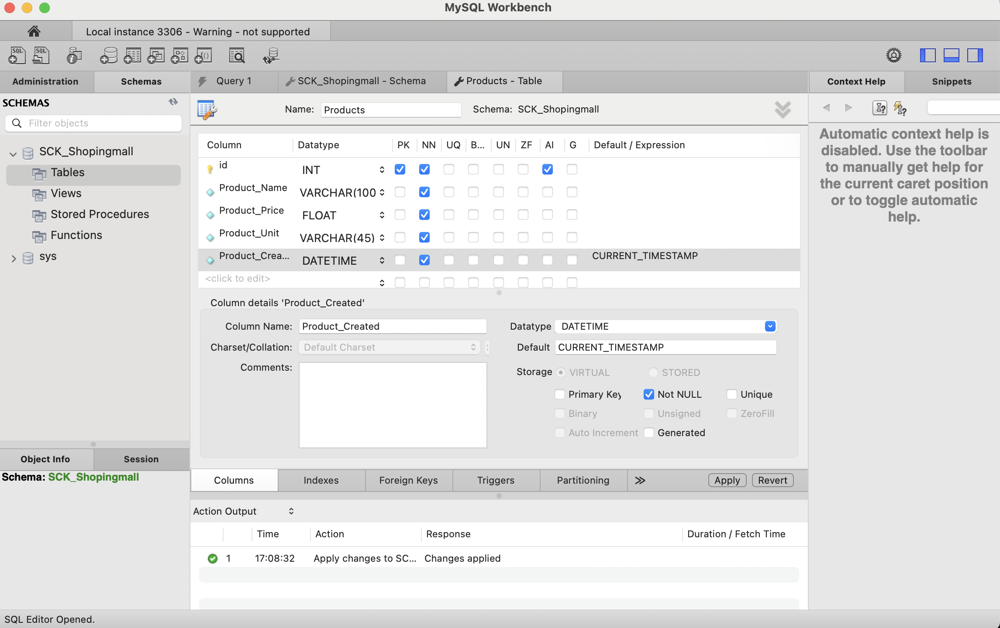
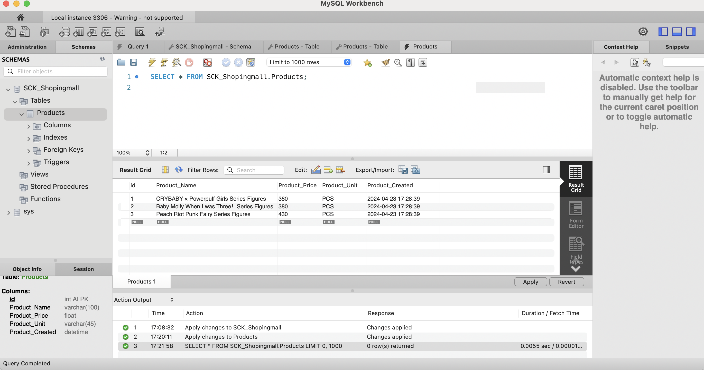

# MySQL-For-Beginner

สรุปสิ่งที่ได้เรียนรู้ในวันที่ 23 เมษายน 2567 

ได้ทดลองสร้าง DB ซึ่งเป็นฐานข้อมูลวสำหรับเก็บข้อมูล ซึ่งวิธีการสร้างมี 2 แบบคือเราจะเขียนคำสั่งสำหรับการทำการสร้าง หรือใช้เครื่องมือเข้ามาช่วยก็ได้เช่นกัน ดังตัวอย่างในภาพ



แต่ละประเภทของข้อมูล จะมีความแตกต่างกัน การเลือกให้เหมาะกับข้อมูลที่ต้องการเก็บเป็นสิ่งสำคัญ ดังนั้นจึงควรรู้เรื่องของชนิดข้อมูลด้วย 

ทดลองเพิ่มข้อมูลของสินค้า เข้าไปในตารางที่เราสร้าง ซึ่งตรงนี้ก็จะสามารถทำได้ทั้งสองแบบเช่นเดียวกัน สิ่งสำคัญคือเราต้องรู้โครงสร้างตารางของเรา ไม่ว่าจะใช้คำสั่งหรือเครื่องมือมาช่วย 



ได้ลองใช้คำสั่งในการแสดงผลข้อมูลตามเงื่อนไขต่างๆ 
ทำตามโจทย์และคิดโจทย์ขึ้นมาเอง สนุกมาก ๆ :)


---
สรุปสิ่งที่ได้เรียนรู้ในวันที่ 24 เมษายน 2567 

การใช้คำสั่ง
 Insert Into สำหรับเพิ่มข้อมูลลงในฐานข้อมูล ซึ่งสามารถทำได้ทั้งแบบทีละรายการ และหลายรายการพร้อมกัน 

 ตัวอย่างเช่น 

```
insert into products (Product_Name,Product_Price,Product_Unit)
values ('HACIPUPU The Sweetheart Figure',1050.00,'PCS');
```

โดยสิ่งที่ต้องระวังสำหรับเรื่องนี้คือตำแหน่งของข้อมูลในแต่ละตาราง จะต้องถูกต้อง


การใช้คำสั่ง Update เพื่อแก้ไขข้อมูลที่มีอยู่ในฐานข้อมูลเดิม

ตัวอย่างเช่น

```
update products
set Product_Price = 500.00
where id = 2 ;
```

การใช้คำสั่ง Delete from เพื่อลบข้อมูลที่มีอยู่ในฐานข้อมูลเดิม

ตัวอย่างเช่น

```
delete from products
where id = 3;
```

คำสั่งต่าง ๆ ถือว่ามีประโยชน์มากในการจัดการฐานข้อมูลของเรา
